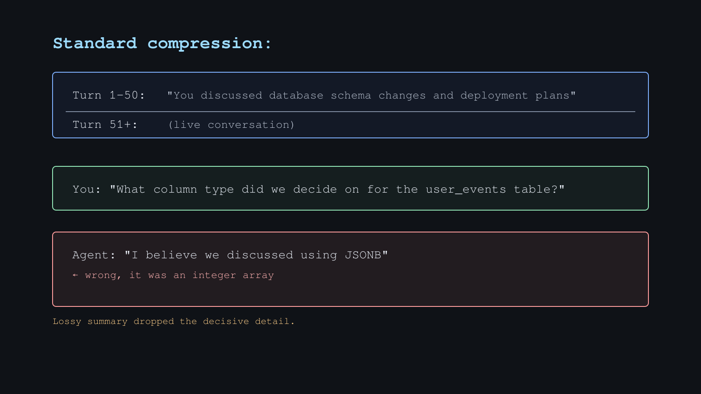
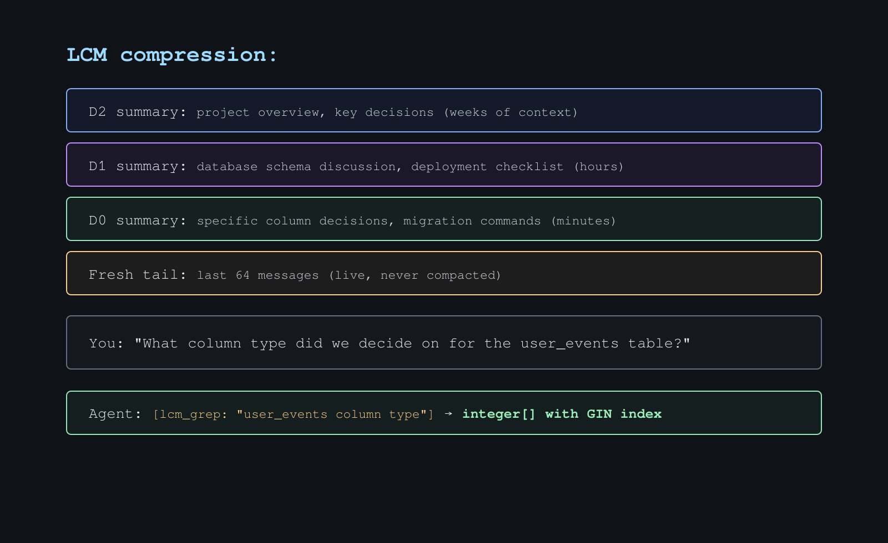
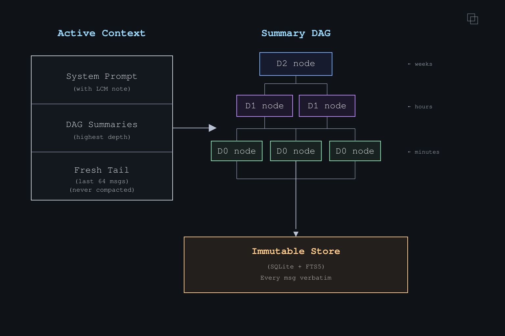

<p align="center">
  
</p>

[](https://github.com/stephenschoettler/hermes-lcm/actions/workflows/ci.yml)
[](https://github.com/stephenschoettler/hermes-lcm/releases)
[](LICENSE)

**Lossless Context Management plugin for [Hermes Agent](https://github.com/NousResearch/hermes-agent)**

> Bounded context, unbounded memory. Nothing is ever lost.

Based on the [LCM paper](https://papers.voltropy.com/LCM) by Ehrlich & Blackman (Voltropy PBC, Feb 2026).
Inspired by [lossless-claw](https://github.com/martian-engineering/lossless-claw) for OpenClaw.

---

## The Problem

When context fills up, agents replace your conversation with a flat lossy summary.
Details get lost. The model confidently misremembers. No way to go back.

<p align="center">
  
</p>

## The Fix

Every message persisted. Hierarchical DAG summaries. Agent tools to drill back
into anything that was compacted.

<p align="center">
  
</p>

<p align="center">
  
</p>

## Why This Plugin

~5,000 lines of Python. Zero external dependencies. 200+ tests that run standalone in under a second. Full lossless context management — immutable-first store, hierarchical DAG, agent retrieval tools, guided compression, assembly guardrails, session filtering — in a single lightweight plugin that drops into Hermes with no build step, no runtime overhead, and nothing to configure beyond `context.engine: lcm`.

## What It Does

- **Immutable-first store** — every message persisted in SQLite, with only narrow explicit opt-in GC tombstones for already-externalized summarized tool results
- **Summary DAG** — hierarchical compaction (D0 minutes → D1 hours → D2 days)
- **3-level escalation** — L1 detailed → L2 bullets → L3 deterministic truncate (guaranteed convergence)
- **Agent tools** — `lcm_grep`, `lcm_describe`, `lcm_expand`, `lcm_expand_query` for structured retrieval
- **Large tool-output handling** — opt-in externalization for oversized tool results, inspectable later via `externalized_ref`
- **Optional transcript GC** — opt-in rewrite of already-externalized summarized tool-result rows to compact GC placeholders instead of deleting them
- **Current-turn search** — live messages ingested before tool execution
- **Session filtering** — exclude noisy sessions entirely or mark them read-only with glob patterns
- **Profile-scoped** — separate DB per Hermes profile

## LCM vs built-in compression

The important distinction is **not** "LCM keeps raw data on disk while Hermes built-in compression deletes it everywhere."

Hermes core persists original conversation history to `state.db` before built-in compression rewrites the active prompt window. That means built-in compression is still lossy in the **active context**, but earlier content can remain recoverable later through Hermes' broader history path such as `session_search`.

`hermes-lcm` solves a different problem:

- it keeps a plugin-local immutable store and DAG specifically for lossless drill-down
- it gives the agent a direct in-plugin recall path for compacted current-session history via `lcm_grep`, `lcm_describe`, `lcm_expand`, and `lcm_expand_query`
- it avoids relying on an auxiliary cross-session retrieval step just to recover details from the conversation that was compacted in front of the agent
- its DAG/source-lineage rules make retrieval behavior more explicit and stable

So the practical comparison is:

- **Built-in compression** — active-context loss is possible, but persisted history may still be recoverable later through a separate host-level path
- **LCM** — the agent gets an explicit, lossless, current-session recall path inside the plugin itself

That is why LCM positioning should focus on **retrieval quality, autonomy, and drill-down behavior**, not on claiming that Hermes core has no persisted record of pre-compression history.

## Requirements

- Hermes Agent with the **pluggable context engine slot** ([PR #7464](https://github.com/NousResearch/hermes-agent/pull/7464))
- Python 3.11+
- No additional dependencies (uses Hermes auxiliary LLM for summarization)

## Install

```bash
# Clone into the context engine plugin directory
git clone https://github.com/stephenschoettler/hermes-lcm \
  ~/.hermes/hermes-agent/plugins/context_engine/lcm

# Or for a specific profile
git clone https://github.com/stephenschoettler/hermes-lcm \
  ~/.hermes/profiles/myprofile/hermes-agent/plugins/context_engine/lcm
```

## Update

```bash
cd ~/.hermes/hermes-agent/plugins/context_engine/lcm && git pull
```

Restart Hermes after updating.

> **Note:** Context engines must be installed under `plugins/context_engine/<name>/`,
> not `plugins/<name>/`. The general `~/.hermes/plugins/` directory is for tools,
> hooks, and CLI extensions — context engines are discovered separately.

Restart Hermes. Activate the engine — either via the interactive UI or config file:

**Option A — `hermes plugins` UI:**

```
hermes plugins
```

The composite plugins screen shows provider categories at the bottom.
Select **Context Engine** and pick `lcm` from the radiolist.

**Option B — config.yaml:**

```yaml
context:
  engine: lcm
```

Verify with `hermes plugins`:

```
Plugins (1):
  ✓ hermes-lcm v0.6.0 (6 tools)

Provider Plugins:
  Context Engine: lcm
```

## Configuration

Environment variables (all optional):

| Variable | Default | Description |
|----------|---------|-------------|
| `LCM_FRESH_TAIL_COUNT` | `64` | Recent messages protected from compaction |
| `LCM_LEAF_CHUNK_TOKENS` | `20000` | Token threshold floor for leaf compaction |
| `LCM_DYNAMIC_LEAF_CHUNK_ENABLED` | `false` | Opt-in dynamic oldest-chunk sizing instead of always compacting the full raw backlog outside the fresh tail |
| `LCM_DYNAMIC_LEAF_CHUNK_MAX` | `50000` | Upper bound for dynamic leaf chunk sizing |
| `LCM_CONTEXT_THRESHOLD` | `0.75` | Fraction of context window triggering compaction |
| `LCM_INCREMENTAL_MAX_DEPTH` | `1` | Max condensation depth (`0` = disabled, `-1` = unlimited) |
| `LCM_CONDENSATION_FANIN` | `4` | Same-depth nodes needed to trigger condensation |
| `LCM_CACHE_FRIENDLY_CONDENSATION_ENABLED` | `false` | Opt-in suppression of low-value follow-on condensation after a leaf pass |
| `LCM_CACHE_FRIENDLY_MIN_DEBT_GROUPS` | `2` | Debt threshold multiplier before cache-friendly gating allows a follow-on condensation pass |
| `LCM_IGNORE_SESSION_PATTERNS` | *(empty)* | Comma-separated glob patterns for sessions to exclude from LCM storage entirely |
| `LCM_STATELESS_SESSION_PATTERNS` | *(empty)* | Comma-separated glob patterns for sessions that stay read-only (`platform:session_id` matching supported) |
| `LCM_LARGE_OUTPUT_EXTERNALIZATION_ENABLED` | `false` | Opt-in externalization of oversized tool-result content into plugin-managed storage |
| `LCM_LARGE_OUTPUT_EXTERNALIZATION_THRESHOLD_CHARS` | `12000` | Character threshold above which tool results are externalized |
| `LCM_LARGE_OUTPUT_EXTERNALIZATION_PATH` | `~/.hermes/lcm-large-outputs` | Override storage directory for externalized payloads |
| `LCM_LARGE_OUTPUT_TRANSCRIPT_GC_ENABLED` | `false` | Opt-in rewrite of already-externalized summarized tool-result transcript rows to compact GC placeholders |
| `LCM_SUMMARY_MODEL` | *(auxiliary)* | Override model for summarization |
| `LCM_EXPANSION_MODEL` | *(summary model / auxiliary)* | Override model for `lcm_expand_query` synthesis |
| `LCM_SUMMARY_TIMEOUT_MS` | `60000` | Timeout for a single model-backed summarization call |
| `LCM_EXPANSION_TIMEOUT_MS` | `120000` | Timeout for `lcm_expand_query` answer synthesis |
| `LCM_DATABASE_PATH` | `~/.hermes/lcm.db` | SQLite database path (auto profile-scoped) |
| `LCM_NEW_SESSION_RETAIN_DEPTH` | `2` | DAG depth retained after `/new` (`-1` = all, `0` = none, `2` = keep d2+) |
| `LCM_ENABLE_SLASH_COMMAND` | `false` | Opt-in registration for `/lcm` gateway slash commands (recommended only for trusted operator contexts) |

The point-8 compaction knobs are intentionally opt-in. `cache_friendly_*` is a plugin-local prompt-stability heuristic, not a claim that Hermes currently passes true prompt-cache metrics into `hermes-lcm`.

### Large tool-output handling

`hermes-lcm` now has a three-step opt-in path for oversized tool results:

1. **9B externalization** — large tool results are written to plugin-managed JSON files instead of being kept inline for compaction prompts
2. **9C retrieval** — those payloads stay inspectable later through `lcm_describe(externalized_ref=...)`, `lcm_expand(externalized_ref=...)`, or expanded summary sources that attach `externalized` metadata
3. **9D transcript GC** — if `LCM_LARGE_OUTPUT_TRANSCRIPT_GC_ENABLED=true`, already-externalized tool-result rows that were successfully summarized can be rewritten to compact GC placeholders instead of keeping the full raw blob inline forever

Important boundaries:
- all of this remains **opt-in**
- transcript GC rewrites only **tool-role** rows that already have a same-session externalized payload
- the row itself is kept (same `store_id`), so summary `source_ids` still resolve cleanly
- pinned messages are skipped
- payload files are **not** deleted by transcript GC; retrieval stays lossless via `externalized_ref`
- transcript GC updates the stored row content and therefore changes raw-message searchability: search should still find summaries / refs, but `lcm_grep` will no longer match the original giant tool blob text after GC

Pattern syntax matches `lossless-claw`:
- `*` matches within one colon-delimited segment
- `**` can span across colons

Hermes currently matches each pattern against multiple candidate keys for flexibility:
- raw `session_id`
- `platform`
- `platform:session_id`

That means patterns like `cron:*` can catch Hermes cron sessions today, while plain raw session-id matching still works if you know the exact IDs you want to target.

## Agent Tools

| Tool | Description |
|------|-------------|
| `lcm_grep` | Search raw messages AND summaries for the active/current session. Use this for intra-session recall after compaction; if you intentionally want cross-session LCM store hits, use `session_scope='all'`; otherwise prefer `session_search` for earlier separate sessions. |
| `lcm_describe` | Inspect current-session DAG structure or an `externalized_ref` payload preview without loading full payload content. No node_id/externalized_ref = session overview. |
| `lcm_expand` | Recover original content from a current-session summary node, or open a stored `externalized_ref` payload directly. |
| `lcm_expand_query` | Answer a question from expanded LCM context for the active/current session using either a query or explicit node_ids. For cross-session recall, prefer `session_search` first. |
| `lcm_status` | Quick health overview — compression count, store size, DAG depth distribution, context usage, and active config. |
| `lcm_doctor` | Run diagnostics — database integrity, FTS index sync, orphaned nodes, config validation, context pressure. |

### Retrieval contract: `session_scope` × `source`

`hermes-lcm` treats `session_scope` and `source` as independent filters:

- **`session_scope`** decides which sessions are eligible
- **`source`** decides which content inside those eligible sessions is allowed to match

That contract applies across:

- raw message retrieval
- DAG summary retrieval
- merged outputs like `lcm_grep`
- carry-over/reassigned summary nodes after `/new`

#### Raw messages

- `current` + no `source` → all raw rows in the current session
- `current` + `source='discord'` → only current-session raw rows with source `discord`
- `all` + no `source` → all raw rows across sessions
- `all` + `source='discord'` → all raw rows across sessions with source `discord`

#### DAG summaries

- `current` + no `source` → all summaries eligible in the current session
- `current` + `source='discord'` → only current-session summaries whose descendant raw-message lineage includes `discord`
- `all` + no `source` → all eligible summaries across sessions
- `all` + `source='discord'` → only summaries across sessions whose descendant raw-message lineage includes `discord`

Mixed-source nodes may match more than one `source` filter if their descendant lineage is mixed. Filtering is based on actual descendant lineage, not on whether the surrounding session happens to contain some message from that source.

#### `unknown` source

`unknown` is treated as a real source value, not as a wildcard.

- omitting `source` means **no source filtering**
- `source='unknown'` means only content whose stored source is `unknown`
- legacy blank-source rows are treated as `unknown` for backward compatibility

#### Carry-over semantics

`carry_over_new_session_context()` may reassign retained summary nodes into a new session, but that does **not** erase source lineage.

- session eligibility may change because the node now belongs to the new session
- source eligibility still comes from the node's descendant raw-message lineage

So a carried-over node can be current-session content in the new session while still matching `source='discord'` only if its descendant raw messages include `discord`.

### Tool choice guidance: LCM tools vs `session_search`

When both recall paths are available to the model:

- prefer **LCM tools** for recall inside the active/current conversation, especially when the relevant turns were compacted into summary nodes
- prefer **`session_search`** when the user is asking about an earlier separate conversation, prior work from another session, or broad cross-session history
- if you explicitly want cross-session hits from the LCM store itself, use `lcm_grep(session_scope='all')` deliberately rather than treating it as the default recall path

That split is intentional:

- `hermes-lcm` is strongest at lossless drill-down inside the current session's DAG/store
- `session_search` is the broader Hermes-wide cross-session recall tool
- putting the distinction in the tool-facing docs/schema keeps ACP/API/editor flows from relying only on accidental schema wording when both surfaces are exposed at once

## Gateway Slash Commands

When Hermes host support for plugin slash commands is available, `hermes-lcm` can expose a `/lcm` operator surface for quick diagnostics and safe maintenance prep from chat.

This surface is **disabled by default** and requires `LCM_ENABLE_SLASH_COMMAND=1` (or `true/yes/on`) before registration.

- `/lcm` or `/lcm status` — current session/runtime status
- `/lcm doctor` — SQLite + FTS health checks and store/node totals
- `/lcm doctor clean` — best-effort read-only scan for obvious junk/noise sessions matched from stored session keys
- `/lcm doctor clean apply` — backup-first cleanup for safe pattern-matched junk/noise session candidates
- `/lcm backup` — create a timestamped SQLite backup before any future cleanup workflow

The cleanup path stays intentionally narrow and backup-first; broader retention/prune workflows should still start with diagnostics before any apply/delete step.

## How It Works

1. **Ingest** — every message persisted verbatim in an immutable SQLite store
2. **Compact** — when context pressure builds, older messages outside the fresh tail are summarized into D0 leaf nodes
3. **Condense** — when enough D0 nodes accumulate, they're condensed into D1 nodes (and so on up)
4. **Escalate** — if a summary is too long, escalate: L1 detailed → L2 bullets → L3 deterministic truncate
5. **Assemble** — active context = system prompt + highest-depth summaries + fresh tail
6. **Retrieve** — agent uses `lcm_grep`/`lcm_describe`/`lcm_expand`/`lcm_expand_query` to drill into compacted history or synthesize answers from expanded context

## Architecture

```
hermes-lcm/
├── plugin.yaml      # manifest
├── __init__.py      # register(ctx) → ctx.register_context_engine()
├── engine.py        # LCMEngine(ContextEngine) — main orchestrator
├── store.py         # immutable SQLite message store (FTS5)
├── dag.py           # summary DAG with depth-aware nodes (FTS5)
├── escalation.py    # L1 → L2 → L3 guaranteed convergence
├── config.py        # LCMConfig + env var overrides
├── command.py       # /lcm slash command handlers for gateway diagnostics
├── tokens.py        # tiktoken with char-based fallback
├── schemas.py       # tool schemas (what the LLM sees)
├── tools.py         # tool handlers (lcm_grep, lcm_describe, lcm_expand, lcm_expand_query)
└── tests/           # standalone pytest coverage
```

**Running tests:**

```bash
pip install pytest
python -m pytest tests/ -v
```

No Hermes Agent checkout required — the test suite includes a lightweight ABC stub so it runs standalone.

## Context Engine Slot

Requires the **pluggable context engine slot** — an ABC (`ContextEngine`) in
hermes-agent core that makes the `ContextCompressor` swappable via the plugin
system. Config-driven selection via `context.engine` in config.yaml, with a
`plugins/context_engine/` discovery directory. Same pattern as OpenClaw's
`contextEngine` slot + `lossless-claw`.

- **PR:** [NousResearch/hermes-agent#7464](https://github.com/NousResearch/hermes-agent/pull/7464) (supersedes [#6126](https://github.com/NousResearch/hermes-agent/pull/6126), [#5700](https://github.com/NousResearch/hermes-agent/pull/5700))
- **Issue:** [NousResearch/hermes-agent#5701](https://github.com/NousResearch/hermes-agent/issues/5701) (closed by #7464)
- **Paper:** [papers.voltropy.com/LCM](https://papers.voltropy.com/LCM)

## Contributing

Issues and PRs welcome. This project has active community contributors and CI runs on every push and PR.

- **Bug fixes** and **correctness improvements** are always top priority
- **New features** should be scoped and backwards-compatible
- **Tests required** — run `python -m pytest tests/ -v` before submitting

See [CONTRIBUTING.md](CONTRIBUTING.md) for issue, branch, validation, and PR guidance.
See the [releases page](https://github.com/stephenschoettler/hermes-lcm/releases) for changelogs.

## License

MIT
